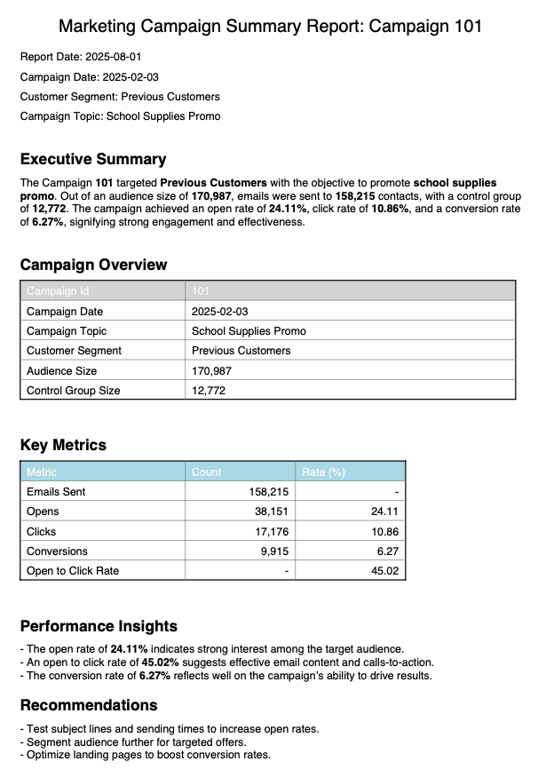
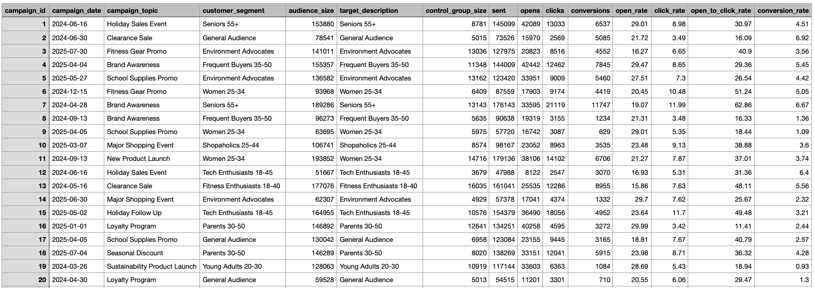

# Campaign Performance Assistant - System Overview

## 📋 Table of Contents
- [Marketing Campaign Context](#marketing-campaign-context)
- [The Challenge](#the-challenge)
- [Our Solution](#our-solution)
- [Target Users](#target-users)
- [Key Benefits](#key-benefits)
- [How It Works](#how-it-works)

---

## 🎯 Marketing Campaign Context

### What Are Marketing Campaigns?
Marketing campaigns are coordinated efforts by organizations to promote their products and services to specific groups of customers. These campaigns involve multiple activities:

- **Target Audience Research**: Identifying the right customer segments
- **Content Creation**: Developing compelling messages and creative materials
- **Campaign Execution**: Launching campaigns across various channels (email, social media, ads, etc.)
- **Performance Tracking**: Monitoring how well campaigns perform against goals

### The Marketing Campaign Team
A typical marketing campaign team includes several specialized roles:

- **Campaign Managers**: Oversee campaign strategy and execution
- **Campaign Analysts**: Collect data and create performance reports
- **Content Creators**: Develop campaign messaging and creative assets
- **Data Analysts**: Analyze campaign metrics and customer behavior
- **Marketing Stakeholders**: Decision-makers who review results and approve future campaigns

### Campaign Performance Reporting
One of the most critical activities is tracking campaign performance. Campaign Analysts regularly:

1. **Collect campaign data** from various sources (databases, analytics tools)
2. **Analyze performance metrics** (open rates, click rates, conversions, ROI)
3. **Create comprehensive reports** with insights and recommendations
4. **Share findings** with stakeholders for decision-making
5. **Document lessons learned** for future campaign improvements

### Campaign Data Storage
Teams maintain detailed information about each campaign, including:

- Campaign objectives and target audience
- Creative assets and messaging
- Performance metrics and KPIs
- Budget allocation and spending
- Timeline and key milestones
- Results analysis and recommendations

---

## 🚫 The Challenge

Marketing campaign teams face several significant challenges when trying to access and analyze their campaign data:

### 1. **Information Fragmentation**
- **Campaign reports** are stored in Confluence with rich analysis and recommendations
- **Raw campaign data** is stored in databases with detailed metrics
- **Institutional knowledge** is scattered across different documents and team members

### 2. **Technical Barriers**
- **SQL Knowledge Gap**: Many marketing professionals don't know how to write SQL queries to extract data from databases
- **Data Access Dependency**: Team members must rely on data analysts or IT support for simple data requests
- **Time Delays**: Getting answers to basic questions can take hours or days

### 3. **Historical Campaign Research**
- **Difficult Search**: Finding specific past campaigns or similar situations requires manual searching through multiple documents
- **Context Loss**: Understanding what worked or didn't work in previous campaigns is time-consuming
- **Knowledge Transfer**: When team members leave, their insights and expertise are often lost

### 4. **Decision-Making Delays**
- **Slow Data Retrieval**: Waiting for technical help slows down campaign planning and optimization
- **Limited Self-Service**: Marketing professionals can't quickly explore data on their own
- **Reduced Agility**: Teams can't respond quickly to market changes or opportunities

---

## ✨ Our Solution: Campaign Performance Assistant

The Campaign Performance Assistant is an AI-powered system that democratizes access to campaign data and insights, enabling marketing professionals to get the information they need through natural language conversations.

### 🤖 What It Does
Our system acts as an intelligent intermediary between marketing professionals and their campaign data, providing:

- **Natural Language Interface**: Ask questions in plain English instead of writing SQL queries
- **Unified Data Access**: Seamlessly searches both campaign reports (Confluence) and database records
- **Intelligent Responses**: Presents information as text summaries, data tables, or visual charts
- **Conversational Memory**: Maintains context across questions for natural follow-up conversations
- **Session Persistence**: Remembers conversation history across different sessions

### 🎯 Core Capabilities

#### **1. Campaign Data Retrieval**
- Query campaign performance metrics without SQL knowledge
- Find campaigns by topic, segment, date range, or performance criteria
- Compare multiple campaigns side-by-side
- Generate summary statistics across campaign portfolios

#### **2. Document Intelligence**
- Search through campaign performance reports and recommendations
- Extract insights from historical campaign analysis
- Find similar campaigns or strategies used in the past
- Access institutional knowledge from past reports

#### **3. Smart Data Presentation**
- **Text Summaries**: Get concise overviews of campaign performance
- **Data Tables**: View structured data in easy-to-read formats
- **Visual Charts**: See trends and comparisons through automatically generated graphs
- **Contextual Insights**: Receive relevant recommendations based on data patterns

#### **4. Conversational Experience**
- **Natural Follow-ups**: Ask related questions without repeating context
- **Clarifying Questions**: System asks for clarification when needed
- **Multi-turn Conversations**: Build understanding through back-and-forth dialogue
- **Memory Across Sessions**: Continue conversations from where you left off

---

## 👥 Target Users

### **Primary Users**

#### **📊 Campaign Analysts**
- **Use Case**: Quickly generate reports, compare campaign performance, find historical trends
- **Benefits**: Spend less time on data extraction, more time on analysis and insights
- **Typical Questions**: 
  - "Show me the top 5 campaigns from last quarter by conversion rate"
  - "What recommendations were made for email campaigns targeting millennials?"

#### **📈 Campaign Managers**
- **Use Case**: Monitor ongoing campaigns, research best practices, make data-driven decisions
- **Benefits**: Self-service access to campaign data, faster decision-making
- **Typical Questions**:
  - "How did our holiday campaigns perform compared to last year?"
  - "What budget allocation worked best for social media campaigns?"

#### **🎯 Marketing Stakeholders**
- **Use Case**: Review campaign performance, understand ROI, approve future strategies
- **Benefits**: Get quick answers without waiting for analyst reports
- **Typical Questions**:
  - "What's our overall campaign ROI for Q3?"
  - "Which customer segments have the highest engagement rates?"

### **Secondary Users**

#### **📝 Content Creators**
- **Use Case**: Understand which messaging and creative approaches work best
- **Typical Questions**: "What subject lines had the highest open rates in healthcare campaigns?"

#### **💰 Budget Managers**
- **Use Case**: Analyze campaign costs and ROI for budget planning
- **Typical Questions**: "What was the average cost per acquisition across our digital campaigns?"

#### **🔍 Market Researchers**
- **Use Case**: Identify trends and patterns across customer segments
- **Typical Questions**: "How do campaign response rates vary by geographic region?"

#### **👔 Executive Leadership**
- **Use Case**: Get high-level insights for strategic decision-making
- **Typical Questions**: "What's our overall marketing campaign effectiveness trend?"

---

## 🎁 Key Benefits

### **For Marketing Professionals**
- ✅ **Self-Service Analytics**: Get answers immediately without technical dependencies
- ✅ **Natural Language**: No need to learn SQL or complex query languages
- ✅ **Comprehensive Access**: Search both structured data and unstructured reports
- ✅ **Visual Insights**: Automatically generated charts and tables for better understanding

### **For Campaign Analysts**
- ✅ **Efficiency Gains**: Spend less time on data extraction, more on analysis
- ✅ **Consistent Access**: Standardized way to access historical campaign insights
- ✅ **Knowledge Preservation**: Institutional knowledge is searchable and accessible
- ✅ **Report Automation**: Quickly generate standard reports and comparisons

### **For Organizations**
- ✅ **Faster Decision-Making**: Reduce time from question to insight
- ✅ **Better Campaign Performance**: Learn from past successes and failures more effectively
- ✅ **Knowledge Retention**: Preserve institutional knowledge when team members change
- ✅ **Increased Agility**: Respond more quickly to market opportunities and challenges

### **For Teams**
- ✅ **Reduced Bottlenecks**: Less dependency on technical team members for data access
- ✅ **Improved Collaboration**: Shared access to campaign insights and data
- ✅ **Enhanced Learning**: Easy exploration of historical campaigns and strategies
- ✅ **Consistent Information**: Everyone accesses the same underlying data sources

---

## ⚙️ How It Works

### **1. Ask Your Question**
Simply type your question in natural language:
- "What were our best-performing email campaigns last quarter?"
- "Show me campaigns targeting healthcare professionals"
- "Compare the ROI of social media vs. email campaigns"

### **2. AI Processing**
The system:
- Analyzes your question to understand intent
- Determines what data sources to search
- Executes appropriate queries against databases and documents
- Processes and synthesizes the results

### **3. Intelligent Response**
Receive answers in the most appropriate format:
- **Text summaries** for insights and recommendations
- **Data tables** for detailed metrics and comparisons
- **Charts and graphs** for trends and visual analysis

### **4. Continue the Conversation**
Ask follow-up questions naturally:
- "Can you show me the details for the top campaign?"
- "What about campaigns from the previous year?"
- "Create a chart comparing these results"

---

## 🚀 Getting Started

Ready to explore your campaign data? The Campaign Performance Assistant is designed to be intuitive and user-friendly. Simply log in and start asking questions about your campaigns - no training required!

*For detailed technical documentation and usage instructions, see our [README.md](README.md).*

---

*This overview provides the foundation for understanding how the Campaign Performance Assistant transforms marketing campaign analysis from a technical challenge into a natural conversation.*
