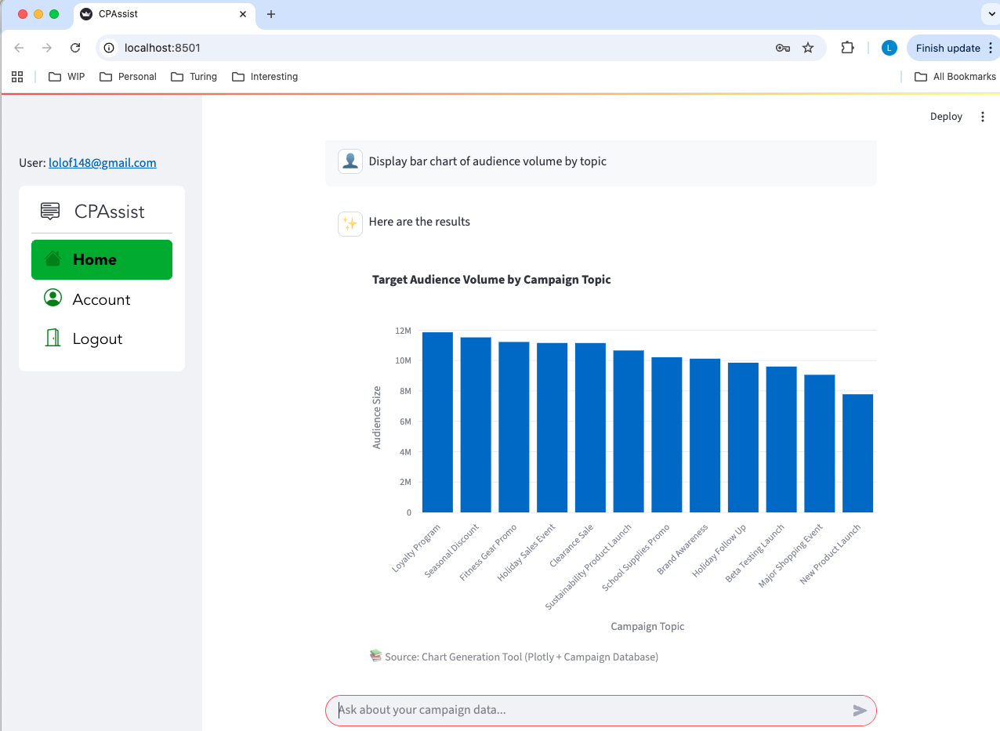

# Campaign Performance AI Assistant - Complete System Documentation

## 📋 Table of Contents

1. [🎯 System Overview](#-system-overview)
2. [🏗️ Architecture](#️-architecture)
3. [🔐 Authentication](#-authentication)
4. [🤖 AI Agent System](#-ai-agent-system)
5. [�🔄 Data Flow](#-data-flow)
6. [🛠️ Tool Selection Process](#️-tool-selection-process)
7. [📄 Document Ingestion Pipeline](#-document-ingestion-pipeline)
8. [🔌 API](#-api)
9. [🧠 Memory Management](#-memory-management)
10. [🏷️ Token Tracking](#-token-tracking)
11. [🧠 Memory Management](#-memory-management)
12. [🏷️ Token Tracking](#-token-tracking)

---

## 🎯 System Overview

The **Campaign Performance AI Assistant** is a comprehensive AI-powered analytics platform that provides intelligent insights into campaign data through multiple interfaces and advanced agent workflows. It combines modern AI technologies with robust data processing capabilities.

> **🆕 New to Campaign Performance Assistant?**
>
> If you're new to the system or unfamiliar with marketing campaign analysis, start with our [README.md](README.md) for a comprehensive introduction to the problem we solve, our solution approach, and how different team members can benefit from the system.

### 🌟 Key Features

✅ **Multi-Interface Access**

- Interactive Streamlit web application
- RESTful API endpoints
- Mobile-responsive web interface

✅ **Advanced AI Agent System**

- LangGraph-powered workflow orchestration
- Intelligent query analysis and routing
- Multi-step reasoning and data retrieval
- Interactive graph visualization and testing
- Dual-layer memory management (short-term + long-term)

✅ **Comprehensive Data Processing**

- Multi-format document support (PDF, HTML, DOCX)
- Vector-based semantic search with ChromaDB
- Structured campaign data management
- Real-time document ingestion pipeline

✅ **Interactive Visualizations**

- Dynamic chart generation
- Structured data tables
- Campaign comparison tools
- Performance analytics dashboards

✅ **Production-Ready Infrastructure**

- Firebase authentication and user management
- LLM token usage tracking and analytics
- Persistent conversation memory with SQLite
- API authentication and rate limiting
- Comprehensive logging and monitoring
- Background document processing
- Health monitoring and observability

---

## 📸 Screenshots

### Campaign Performance Assistant Interface

The following screenshots showcase the key features and user interface of the Campaign Performance Assistant:

## Login


## Home


## Text Response


## Table Response


## Chart Response



## Account - Token


---

## 🏗️ Architecture


### Core Components

#### **Frontend Layer**

- **Streamlit UI**: Web-based chat interface with authentication
- **Mobile Access**: Responsive design for mobile devices
- **API Access**: Direct REST API consumption

#### **AI/Agents Layer** 🆕

- **LangGraph Workflow**: Advanced graph-based AI orchestration
- **LangChain**: AI framework and tool management
- **OpenAI/LM Studio**: Large Language Model processing
- **Tool Selection**: Intelligent tool routing and data sourcing
- **Response Generator**: Contextual response creation with insights

#### **Vector DB Layer**

- **Document Loader**: Multi-format document processing
- **ChromaDB**: Vector database for document embeddings and semantic search

#### **API Layer**

- **FastAPI**: High-performance REST API with authentication

#### **System Services**

- **SQLite Database**: Structured campaign data storage
- **Logging**: System monitoring and debugging
- **Memory Management**: Resource optimization
- **Token Tracking**: Usage monitoring and analytics

#### **Authentication**

- **Firebase Auth**: Production-grade user authentication and session management

---

## 🔐 Authentication

The Campaign Performance AI Assistant implements enterprise-grade authentication using **Firebase Authentication**, Google's production-ready authentication service. This provides secure user management, session handling, and role-based access control.

### Firebase Authentication Features

#### **User Management**

- **Sign Up**: New user registration with email validation
- **Sign In**: Secure login with email and password
- **Password Reset**: Self-service password reset via email
- **Session Management**: Secure token-based sessions
- **Auto-Logout**: Session cleanup and memory clearing

#### **Security Features**

- **Secure Tokens**: Firebase-issued JWT tokens
- **Email Validation**: Built-in email format validation
- **Password Requirements**: Minimum 6-character passwords
- **Error Handling**: Comprehensive error reporting
- **Session Security**: Automatic session validation

#### **User Experience**

- **Responsive Design**: Mobile-friendly authentication interface
- **Tab Navigation**: Seamless switching between login, signup, and reset
- **Visual Feedback**: Success animations and clear error messages
- **Auto-Login**: Automatic login after successful registration
- **Remember State**: Persistent authentication across sessions

### Authentication Flow


### Integration with AI System

#### **Conversation Memory**

- Each user has isolated conversation memory
- Memory is cleared automatically on logout
- Thread ID is based on username for consistency

#### **User Context**

- AI assistant has access to user information
- Responses can be personalized based on user role
- Session tracking for analytics and monitoring

---

## 🤖 AI Agent System

### LangGraph Agent Architecture

The Campaign Assistant uses a sophisticated LangGraph-based agent system that provides intelligent query processing through a structured workflow.

#### **Agent Workflow Components**


The diagram above shows the complete LangGraph workflow with three main processing nodes and conditional routing logic.

#### **1. Query Analyzer Node**

- **Purpose**: Analyze user intent and extract query requirements
- **Functions**:
  - Understand user intent (performance, analysis, comparison, general)
  - Extract entities (campaign names, date ranges, metrics)
  - Determine if data retrieval is needed
  - Set query classification for downstream processing
- **Input**: User query and conversation state
- **Output**: Analyzed query with extracted entities and data requirements

#### **2. Data Retriever Node**

- **Purpose**: Fetch relevant campaign data based on query analysis
- **Functions**:
  - Query campaign database for structured data
  - Search document vectors for unstructured insights
  - Aggregate and format retrieved information
  - Handle multiple data sources and formats
- **Input**: Query requirements and entity extractions
- **Output**: Relevant data formatted for response generation

#### **3. Response Generator Node**

- **Purpose**: Create comprehensive, formatted responses with insights
- **Functions**:
  - Generate performance summaries and analysis
  - Create comparison reports between campaigns
  - Suggest appropriate visualizations (charts, tables)
  - Provide actionable recommendations and insights
- **Input**: User query, retrieved data, and query context
- **Output**: Formatted markdown response with chart suggestions

#### **4. Conditional Logic (`should_retrieve_data`)**

- **Purpose**: Intelligent routing based on query requirements
- **Logic**:
  - If `needs_data = True` → Route to Data Retriever
  - If `needs_data = False` → Skip directly to Response Generator
- **Benefits**: Optimizes performance by avoiding unnecessary data fetches

#### **Key Features**

- **Conditional Routing**: Intelligent workflow branching based on query needs
- **Entity Extraction**: Advanced parsing of campaign names, metrics, and dates
- **Multi-format Responses**: Support for text, tables, and chart recommendations
- **Error Handling**: Robust error recovery and user-friendly messages

---

## 🛠️ Tool Selection


### Available Tools

| Tool                            | Purpose                 | Data Source | Agent Integration |
| ------------------------------- | ----------------------- | ----------- | ----------------- |
| `search_campaign_documents`   | Document content search | ChromaDB    | ✅ Available      |
| `get_campaign_by_id`          | Specific campaign data  | FastAPI     | ✅ Available      |
| `get_top_campaigns_by_metric` | Top performers          | FastAPI     | ✅ Available      |
| `get_campaigns_by_topic`      | Topic-based filtering   | FastAPI     | ✅ Available      |
| `get_campaigns_by_segment`    | Segment-based filtering | FastAPI     | ✅ Available      |
| `get_campaign_summary_stats`  | Overall statistics      | FastAPI     | ✅ Available      |
| `compare_campaigns_by_id`     | Campaign comparison     | FastAPI     | ✅ Available      |
| `create_campaign_chart`       | Chart generation        | FastAPI     | ✅ Available      |

### Simplified Tool Selection Flow

The LangGraph agent system provides an intelligent tool selection process:

1. **User Query** → **Streamlit UI** (Frontend Interface)
2. **LangGraph Processing** → **Query Analyzer** (Intent Detection)
3. **Tool Selector** → **Tool Library** (Intelligent Tool Selection)
4. **Data Access** → **FastAPI/ChromaDB** (Data Retrieval)
5. **Response Generator** → **Streamlit UI** (Results Display)

### Tool Selection Logic

✅ **Smart Analysis**: LangGraph analyzes user intent and selects appropriate tools
✅ **Automatic Routing**: No manual tool selection - system decides based on query type
✅ **Data Source Optimization**: Tools automatically access the right data sources
✅ **Seamless Integration**: Tool results flow back through response generation

---

## 📄 Document Ingestion


### Processing Steps

1. **File Upload**: PDF, HTML, DOCX files placed in landing folder
2. **File Monitoring**: Watchdog detects new files automatically
3. **Document Loading**: Format-specific loaders extract text content
4. **Text Chunking**: Documents split into 1000-character chunks with overlap
5. **Deduplication**: MD5 hash-based duplicate detection and prevention
6. **Embedding Generation**: HuggingFace embeddings created for semantic search
7. **Vector Storage**: Embeddings stored in ChromaDB with metadata
8. **File Movement**: Processed files moved to done folder
9. **Logging**: All steps logged for monitoring and debugging

### Supported Formats

- **PDF**: PyPDFLoader with text extraction
- **HTML**: UnstructuredHTMLLoader with content parsing
- **DOCX**: UnstructuredWordDocumentLoader with formatting preservation

### Integration with Agent System

The document ingestion pipeline seamlessly integrates with the LangGraph agent:

- **Vector Search**: Agent can query ChromaDB for document content
- **Source Attribution**: Responses include document source information
- **Real-time Updates**: New documents become immediately searchable

---

## 🔌 API


### API Endpoint Structure

The FastAPI server provides clearly organized endpoint categories with individual endpoints:

#### **System Endpoints (Individual Icons)**

- `GET /` - Root health check and API status
- `GET /health` - Detailed system health monitoring
- `GET /auth/verify` - API key validation and authentication

#### **Campaign Data Endpoints (Grouped)**

- `GET /campaigns/{id}` - Individual campaign details
- `GET /campaigns/all` - All campaigns list
- `GET /campaigns/summary` - Summary statistics
- `GET /campaigns/top/{metric}` - Top performing campaigns
- `GET /campaigns/topic/{topic}` - Topic-based filtering
- `GET /campaigns/segment/{segment}` - Segment-based filtering
- `GET /campaigns/compare/{id1}/{id2}` - Campaign comparison

#### **Documentation Endpoints (Individual Icons)**

- `GET /docs` - Swagger UI interactive documentation
- `GET /redoc` - ReDoc alternative documentation interface

---

## 🧠 Memory Management

The Campaign Performance AI Assistant implements a sophisticated dual-layer memory system that provides both short-term session continuity and long-term conversation persistence across user sessions.

### Memory Architecture


### Dual-Layer Memory System

#### **Short-Term Memory (Session-Based)**

- **Purpose**: Maintains conversation context within the current session
- **Storage**: LangGraph checkpointer with SQLite backend
- **Scope**: Active until session ends or chat is cleared
- **Features**:
  - Real-time conversation context
  - Tool usage history
  - State persistence across agent nodes
  - Automatic cleanup on session end

#### **Long-Term Memory (Persistent)**

- **Purpose**: Restores conversation history across sessions
- **Storage**: SQLite database with structured tables
- **Scope**: Persistent across browser sessions and app restarts
- **Features**:
  - User-specific conversation threads
  - Message history with metadata
  - Response type tracking (text, charts, tables)
  - Source attribution persistence

### Memory Components

#### **LangGraph Checkpointer**

The agent uses LangGraph's SQLite checkpointer for short-term memory:

```python
# Checkpointer configuration
from langgraph.checkpoint.sqlite import SqliteSaver
checkpointer = SqliteSaver(conn)

# Thread-based conversation tracking
thread_config = {
    "configurable": {
        "thread_id": username,
        "user_id": user_id
    }
}
```

### Memory Features

#### **Conversation Continuity**

- **Session Memory**: Maintains context during active chat sessions
- **History Restoration**: Automatically loads previous conversations on login
- **Thread Isolation**: Each user has isolated conversation threads
- **Context Preservation**: Maintains conversation flow across page refreshes

#### **Intelligent Memory Management**

- **Selective Loading**: Only loads text messages for conversation context
- **Memory Limits**: Configurable message limits to prevent memory overflow
- **Efficient Storage**: Optimized database schema for fast retrieval
- **Automatic Cleanup**: Memory cleanup on user logout

### User Experience

#### **Seamless Restoration**

- **Automatic Loading**: Previous conversations load automatically on login
- **Visual Indicators**: Clear indication when chat history is restored
- **Progressive Loading**: Efficient loading of large conversation histories
- **Context Awareness**: AI agent has full context from previous sessions

#### **Memory Management Controls**

- **Clear Chat History**: One-click conversation clearing
- **Memory Statistics**: View conversation and memory usage stats
- **Selective Clearing**: Option to clear specific conversation threads
- **Memory Health**: Monitoring of memory usage and performance

### Memory Benefits

#### **Enhanced User Experience**

✅ **Conversation Continuity**: Pick up conversations where you left off
✅ **Context Preservation**: AI remembers previous discussions and decisions
✅ **Personalization**: Responses improve based on conversation history
✅ **Efficiency**: No need to re-establish context in new sessions

#### **System Performance**

✅ **Intelligent Caching**: Efficient memory usage with selective loading
✅ **Scalable Storage**: SQLite-based storage scales with user base
✅ **Fast Retrieval**: Optimized queries for quick history loading
✅ **Resource Management**: Configurable limits prevent memory overflow

#### **Data Integrity**

✅ **User Isolation**: Complete isolation between user conversations
✅ **Data Persistence**: Reliable storage with ACID compliance
✅ **Backup Ready**: SQLite database enables easy backup and migration
✅ **Privacy Compliant**: User-specific data with proper access controls

---

## 🏷️ Token Tracking

The Campaign Performance AI Assistant implements comprehensive LLM token tracking at the user level, providing transparency, cost control, and usage analytics for optimal resource management.

### Token Tracking Architecture


### Token Tracking Features

#### **Real-Time Token Monitoring**

- **Input Token Tracking**: Monitors tokens sent to the LLM
- **Output Token Tracking**: Tracks tokens generated by the LLM
- **Total Token Calculation**: Automatic sum of input + output tokens
- **Per-Query Tracking**: Individual query token usage
- **Thread-Based Isolation**: Token tracking per conversation thread

#### **User-Level Analytics**

- **Total Usage Statistics**: Cumulative token consumption
- **Query Analytics**: Average tokens per query
- **Usage Trends**: Historical token consumption patterns
- **Recent Activity**: Last 5 queries with token usage
- **Performance Metrics**: Efficiency and usage insights

### Cost Management

#### **Usage Transparency**

✅ **Real-Time Tracking**: Users see exact token consumption
✅ **Historical Data**: Track usage trends over time
✅ **Query-Level Detail**: Understand which queries consume more tokens
✅ **Efficiency Metrics**: Average tokens per query insights

#### **Cost Control Features**

- **Usage Monitoring**: Track token consumption patterns
- **Efficiency Analysis**: Identify high-consumption queries
- **Historical Trends**: Monitor usage growth over time
- **Resource Planning**: Data for capacity planning

### Benefits

#### **For Users**

✅ **Cost Transparency**: Clear understanding of AI usage costs
✅ **Usage Insights**: Learn which queries are most efficient
✅ **Budget Planning**: Historical data for cost forecasting
✅ **Optimization**: Improve query efficiency based on token usage

#### **For Administrators**

✅ **Resource Monitoring**: Track total system token consumption
✅ **User Analytics**: Understand usage patterns across users
✅ **Cost Management**: Monitor and control LLM costs
✅ **Capacity Planning**: Data-driven infrastructure decisions

#### **For Developers**

✅ **Performance Metrics**: Optimize agent performance based on token usage
✅ **Feature Analysis**: Understand which features consume most tokens
✅ **Efficiency Tracking**: Monitor improvements in prompt engineering
✅ **Debugging**: Identify inefficient operations

---

## 🚀 Installation & Setup

### Prerequisites

- **Python**: 3.11+ (required for LangGraph compatibility)
- **UV Package Manager**: Modern Python dependency management
- **Graphviz**: For diagram generation (optional)

### Quick Start Installation

1. **Clone the repository**

   ```bash
   git clone <repository-url>
   cd project-23
   ```
2. **Install dependencies with UV**

   ```bash
   uv sync
   ```
3. **Set up environment variables**

   ```bash
   cp .env.example .env
   # Edit .env with your configuration
   ```
4. **Initialize the system**

   ```bash
   # Initialize databases
   python databases/setup/setup_all.py

   # Start services
   uv run streamlit run streamlit_app.py
   ```

# Quick Start with Docker (Recommended)

The easiest way to run the entire system is using Docker Compose:

```bash
# Start all services
make up

# Or using docker compose directly
docker compose -f docker/docker-compose.yml up -d
```

This will start the following services:
- MySQL Database (port 3306)
- ChromaDB Vector Store (port 8030)
- Web Server (port 8080)
- FastAPI Backend (port 8000)
- Streamlit Frontend (port 8501)

### Docker Management Commands

```bash
make down    # Stop all services
make ps      # Show running services
make logs    # View logs
make clean   # Clean up all containers and volumes
```

### Service URLs
- Main Application: http://localhost:8501
- API Documentation: http://localhost:8000/docs
- Web Server: http://localhost:8080

---

## Manual Installation

If you prefer to run the services individually or are doing development work, follow these detailed steps:

#### **1. Environment Configuration**

**Required environment variables:**

```bash
# AI Models
OPENAI_API_KEY=your_openai_api_key_here

# Authentication (optional)
FIREBASE_API_KEY=your_firebase_api_key
FIREBASE_AUTH_DOMAIN=your_project.firebaseapp.com
FIREBASE_PROJECT_ID=your_project_id
FIREBASE_STORAGE_BUCKET=your_project.appspot.com
FIREBASE_MESSAGING_SENDER_ID=your_sender_id
FIREBASE_APP_ID=your_app_id
FIREBASE_MEASUREMENT_ID=your_measurement_id

# Note: LangSmith monitoring has been removed from the architecture
```

#### **2. Database Setup**

```bash
# Initialize all databases and sample data
python databases/setup/setup_all.py

# Or initialize individual components
python databases/setup/campaigns_setup.py
python databases/setup/chroma_cleanup.py
```

#### **3. Firebase Authentication Setup**

**Create Firebase Project:**

1. Go to [Firebase Console](https://console.firebase.google.com/)
2. Create a new project or use existing one
3. Enable Authentication in the Firebase Console
4. Set up Email/Password authentication method
5. Copy your Firebase configuration

**Configure Email Templates (Optional):**

- Customize password reset email templates
- Set up sender email address
- Configure email verification templates

#### **4. Document Ingestion Setup**

```bash
# Start document processing service
cd docs_loader
python ingest.py &
```

#### **5. API Server (Optional)**

```bash
# Start FastAPI server for direct API access
cd api
uvicorn main:app --reload
```

## 📖 Usage Guide

### Starting the System

#### **1. Complete System Startup**

```bash
# Start all services with UV
uv run streamlit run streamlit_app.py
```

#### **2. Development Mode**

```bash
# Start with auto-reload for development
uv run streamlit run streamlit_app.py --reload
```

#### **3. API-Only Mode**

```bash
# Start just the FastAPI server
cd api
uvicorn main:app --reload
```

### Accessing the Application

- **Main Application**: http://localhost:8501
- **API Documentation**: http://localhost:8000/docs (if API server running)
- **Health Check**: http://localhost:8000/health

### Sample Queries

#### **Document Search Queries**

- "What does the executive summary say about campaign 101?"
- "Show me performance insights from the reports"
- "What recommendations are in the campaign documents?"
- "Find information about audience engagement strategies"

#### **Structured Data Queries**

- "What are the metrics for campaign 102?"
- "Show me the top 5 campaigns by conversion rate"
- "Compare campaigns 101 and 102"
- "Get summary statistics for all campaigns"
- "Which campaigns performed best in Q4?"

#### **Analysis and Comparison Queries**

- "Analyze the conversion trends for retail campaigns"
- "Compare performance between email and social campaigns"
- "What insights can you provide about campaign effectiveness?"
- "Show me trends in campaign performance over time"

#### **Visualization Queries**

- "Create a bar chart of audience volume by topic"
- "Show me a table of top campaigns by opens"
- "Generate a comparison chart for recent campaigns"

### Response Types

1. **Text Responses**: Natural language explanations with insights
2. **Table Responses**: Structured data in formatted tables
3. **Chart Responses**: Interactive visualizations with Plotly
4. **Agent Responses**: Multi-step reasoning with source attribution
5. **Error Responses**: Clear error messages with guidance

### Source Attribution

All responses include comprehensive source information:

- **Vector Database**: Document name, type, and relevance score
- **Campaign Database**: Table reference and query details
- **Agent Processing**: Step-by-step workflow execution
- **Tool Usage**: Specific tools and data sources used

---

*For the most up-to-date information, please refer to the repository documentation and release notes.*
